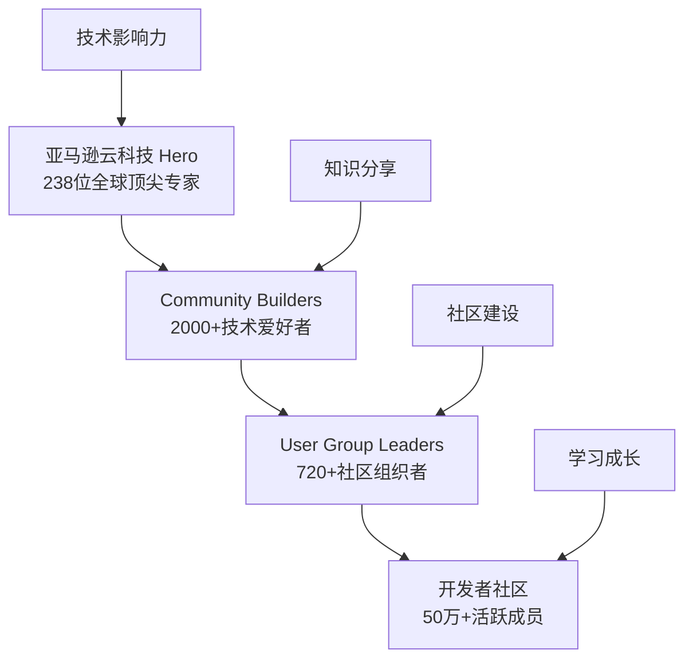

# UG 社区简介

## 🌟 欢迎来到亚马逊云科技 UG China

亚马逊云科技 User Group China 是一个充满活力的开发者社区，汇聚了众多热情的技术专家和开发者。我们致力于为开发者提供学习、分享和成长的平台。

## 🏗️ 社区生态架构

## 🎯 我们的使命

- **🎓 技术学习** - 提供最新的亚马逊云科技技术分享和培训
- **🤝 社区建设** - 连接志同道合的技术伙伴
- **🚀 创新实践** - 推动云计算技术的创新应用
- **🌱 人才培养** - 支持开发者的职业发展和技能提升

## 📊 社区规模

| 层级 | 全球规模 | 中国规模 |
|------|----------|----------|
| **Hero** | 238位，覆盖55个国家 | 16位（大中华区），9位（中国大陆） |
| **Community Builders** | 2000+开发者 | 数十位活跃成员 |
| **User Groups** | 470+UG，100+国家 | 12个UG（10个正式，2个试运营） |
| **UG Leaders** | 720+负责人 | 28位负责人 |
| **活跃会员** | 50万+开发者 | 持续增长中 |

## 🔥 2024年发展目标

### 核心战略
1. **独立运营** - 由UG组委会全权负责社区运营
2. **专业化提升** - 专业开发者比例从10%提升至30%
3. **内容深度** - 提供更有深度的技术内容
4. **品牌影响力** - 提升在用户和合作伙伴中的知名度
5. **规模增长** - 实现用户数和活动参与度的显著增长

### 创新举措
- **技术分会** - 以技术主题为核心的专业分会
- **城市分会** - 以地域为核心的本地化运营
- **深度内容** - 维护专业讲师群，提升分享质量

## 🛠️ 技术聚焦领域

我们围绕6大核心技术领域开展活动：

### 1. 🤖 AI/ML (人工智能与机器学习)
- 生成式AI技术和应用
- 机器学习模型训练和部署
- Amazon SageMaker 实践
- AI伦理和负责任的AI

### 2. 📦 Container (容器技术)
- Docker 和 Kubernetes 实践
- Amazon ECS/EKS 服务
- 微服务架构设计
- 容器安全和最佳实践

### 3. 📊 Data (数据技术)
- 大数据处理和分析
- 数据湖和数据仓库
- 实时数据流处理
- 数据治理和安全

### 4. 🛠️ DevTools (开发工具)
- CI/CD 流水线构建
- 基础设施即代码
- 监控和可观测性
- 开发效率提升

### 5. ⚡ Serverless (无服务器计算)
- AWS Lambda 函数开发
- 事件驱动架构
- 成本优化策略
- 性能调优技巧

### 6. 🌐 IoT (物联网)
- 设备连接和管理
- 边缘计算应用
- 数据采集和处理
- 安全和设备管理

## 🎪 丰富的活动形式

### 线下活动
- **Community Day** - 年度大型技术盛会（300人规模）
- **Meetup** - 定期技术聚会（50-100人）
- **Workshop** - 动手实践工作坊
- **Panel Discussion** - 技术大咖圆桌讨论

### 线上活动
- **NightTalk** - 每周四晚技术分享（会员专享）
- **Tech Talk** - 官方技术讲座
- **Webinar** - 在线研讨会

### 特色活动
- **IWD** - 国际妇女节女性开发者专场
- **re:Invent Recap** - 年度大会内容解读

## 🌈 加入我们的理由

### 对于技术爱好者
- 🎓 学习最新云计算技术
- 🤝 结识技术圈朋友
- 📚 获得学习资源和指导
- 🎁 参与社区活动获得礼品

### 对于专业开发者
- 💼 提升职业技能和竞争力
- 🌐 扩展专业人脉网络
- 📈 获得职业发展机会
- 🏆 展示技术实力和影响力

### 对于技术管理者
- 🎯 了解行业技术趋势
- 👥 发现和培养技术人才
- 🤝 建立合作伙伴关系
- 📊 获得技术决策参考

## 🚀 开始你的社区之旅

无论你是刚接触云计算的新手，还是经验丰富的技术专家，UG China 都为你准备了合适的角色和发展路径：

**立即行动：**
1. 📝 注册成为社区会员
2. 📅 参加我们的活动
3. 💬 加入技术交流群
4. 🎯 找到你感兴趣的技术领域
5. 🚀 开始你的贡献之旅

---

*让我们一起构建更好的开发者社区，推动云计算技术的发展和创新！*