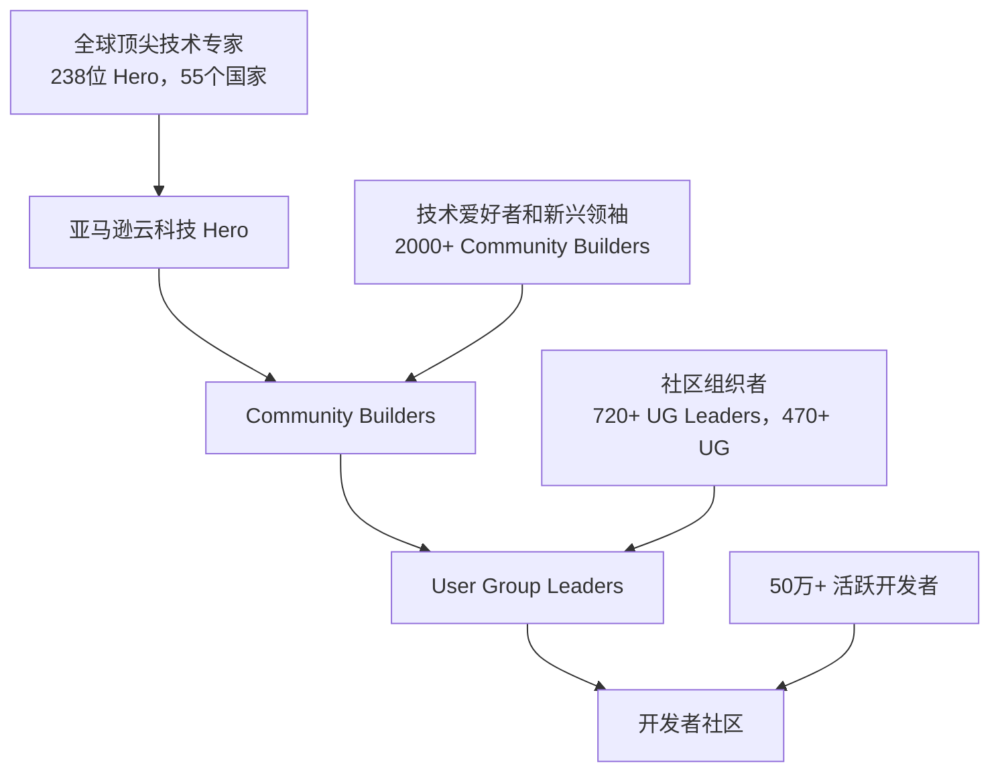

# 社区简介

## 🌍 亚马逊云科技开发者生态

亚马逊云科技开发者社区是一个全球性的技术社区，如同一个金字塔结构，为不同阶段的开发者提供相应的支持和发展机会。

### 开发者生态层级

## 🏆 Hero 项目

**全球顶尖的亚马逊云科技技术专家**

Hero 项目旨在发现和认可在开发者社区中最具影响力的技术专家。

### Hero 类别
- Community Heroes
- Container Heroes  
- Machine Learning Heroes
- Serverless Heroes
- Data Heroes
- Security Heroes
- DevTools Heroes

### 大中华地区 Heroes
全球共有238位 Hero 分布于55个国家和地区，大中华地区共有16位 Heroes，其中9位来自中国大陆。

### Hero 福利
| 类别 | 福利内容 |
|------|----------|
| **产品服务** | • 提前了解产品 roadmap • 每年$2000服务抵扣券 • 与产品团队直接沟通 |
| **全球影响力** | • re:Invent 免费门票和差旅 • 全球开发者平台流量支持 • 与全球 Hero 网络连接 |
| **本地支持** | • 参与市场活动演讲 • 与本地团队紧密合作 • 本地开发者网络建设 |

## 🌟 Community Builders 项目

**技术爱好者和新兴技术领袖的成长平台**

为热衷于分享知识和社区建设的开发者提供支持。

### CB 福利
- 每年$500亚马逊云科技服务抵扣券
- 免费认证考试机会
- 专属 Slack 交流群
- re:Invent 折扣门票
- 每周技术分享和讨论

### 申请时间
每年一月前后开放申请

## 🏘️ User Group 项目

**面向开发者的学习和分享平台**

### UG 特点
- **社区导向** - 独立运作的用户社区
- **技术聚焦** - 围绕6大技术话题进行分享
- **全球网络** - 470+ UG，覆盖100+国家
- **本地化** - 根据地区特色组织活动

### 技术话题
1. **Container** - 容器技术
2. **AI/ML** - 人工智能和机器学习  
3. **Data** - 数据相关技术
4. **DevTools** - 开发工具
5. **Serverless** - 无服务器计算
6. **IoT** - 物联网技术

### 中国 UG 发展
- **2021年** - 重新规划启动
- **2024年** - 发展至12个UG（10个正式，2个试运营）
- **团队规模** - 28个UG负责人

## 🎯 2024年新目标

### 核心重点
1. **独立运营** - 由UG组委会全权负责
2. **专业化** - 提升专业开发者比例至30%
3. **深度内容** - 维护专业讲师群，提升内容质量
4. **品牌建设** - 增加在用户和合作伙伴中的曝光
5. **规模增长** - 用户组、用户数和活动参与度全面增长

### 组织形式创新
- **城市分会** - 以城市为核心的线下聚会
- **技术分会** - 以技术主题为核心的线上聚会
- **跨地域协作** - 线上线下结合的活动模式