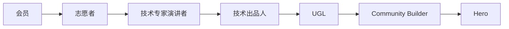

# 成员类别

## 🏆 亚马逊云科技 Hero

### 项目简介
Hero 项目旨在发现和认可在亚马逊云科技开发者社区中最具影响力和号召力的技术专家，与他们一起提高亚马逊云科技在社区和用户中的影响力。

### Hero 类别
1. **Community Heroes** - 社区建设专家
2. **Container Heroes** - 容器技术专家
3. **Machine Learning Heroes** - 机器学习专家
4. **Serverless Heroes** - 无服务器计算专家
5. **Data Heroes** - 数据技术专家
6. **Security Heroes** - 安全技术专家
7. **DevTools Heroes** - 开发工具专家

### 全球分布
- **全球总数**：238位 Hero
- **覆盖范围**：55个国家和地区
- **大中华地区**：16位 Heroes
- **中国大陆**：9位 Heroes

### Hero 权益

| 权益类别 | 具体内容 |
|----------|----------|
| **产品和服务** | • 提前了解产品和服务最新动向和 roadmap • 定期与产品团队核心成员面对面沟通 • 每年$2000亚马逊云科技服务抵扣券 |
| **全球影响力** | • 每年 re:Invent 免费门票和差旅赞助 • 在 Hero 官方网站、dev.to、community.aws 等平台获取流量支持 • 与全球 Hero 和开发者建立联系 |
| **本地支持** | • 作为演讲嘉宾参与市场活动和社区聚会 • 与本地开发者和社区建立联系合作 • 与本地团队建立紧密联系 |

### 申请方式
- **要求**：需内部推荐
- **申请链接**：https://dev.amazoncloud.cn/ug/form/hero

---

## 🌟 Community Builders (CB)

### 项目简介
为开发者社区中热衷于分享知识和技术社区建设的亚马逊云科技技术爱好者以及新兴技术领袖提供技术支持、建立社区联系以及交流机会。

### 全球规模
- **全球总数**：超过2000位开发者
- **申请时间**：每年一月前后开放申请

### CB 权益
- 💰 每年$500亚马逊云科技服务抵扣券
- 📜 每年一次任意认证考试抵扣券
- 🎓 免费订阅官方线上培训课程
- 💬 专属 Community Builder Slack 交流群
- 🎁 Community Builder 定制欢迎礼包
- 🎫 re:Invent 折扣门票和大会现场技术分享机会
- 📅 每周在线技术分享和讨论（英文，需签署保密协议）
- 🤝 亚马逊云科技技术团队提供支持和交流机会

### 申请方式
- **申请链接**：https://aws.amazon.com/cn/developer/community/community-builders/

---

## 👨‍💼 User Group Leader (UGL)

### 角色定义
UGL 是亚马逊云科技 UserGroup 的延伸，对社区团队非常重要。需要具备组织性、积极主动的特质，致力于建立支持性空间，帮助大家一起学习和成长。

### UGL 类型

#### 1. 城市组织者
**职责：**
- 担任 UserGroup 成员的主要联系人
- 每年至少举办四次活动（每季度一次）
- 使用官方活动平台开展所有活动
- 为活动确定主题、招募发言人并寻找场地
- 与组委会保持联系，参加月度电话会议

**要求：**
- 对亚马逊云科技某一行业或技术领域有热情和理解
- 愿意为 UG/社区做出贡献
- 积极与本地社区进行深入合作

#### 2. 技术出品人 (Track Owner)
**人员构成：**
- 亚马逊云科技员工
- Hero
- Community Builder
- 社区资深技术专家

**主要任务：**
1. 基于年度主题方向，制订话题方向供 UGL 参考
2. 协助各个 UG 分会给出活动主题建议
3. 对整体内容 PPT 进行审查，拥有否决权
4. 组织 NightTalk 系列活动

#### 3. 技术专家演讲者 (Speaker)
**职责：**
1. 根据技术出品人发布的内容框架，提供分享主题内容
2. 要求对具体演讲主题有足够了解
3. 可以进行面向开发者的代码开发演讲
4. 分享具体技术和案例

### UGL 福利
- 🎯 发展专业品牌、技能组合、人际网络和领导技能
- 🏆 在亚马逊云科技用户中获得认可和声誉
- 🎖️ 在开发者社区中添加特别表彰和数字徽章
- 📜 提供免费的亚马逊云科技认证考试（每年一次）
- 🌐 与全球其他 UserGroup 负责人进行沟通
- 🎪 参加专为负责人举办的大会和其他活动
- 🎁 获得组长专属品牌礼品和活动机会
- 🏅 颁发年度卓越 UserGroup 社区组织者认证
- ✈️ 最活跃的 UGL 有机会获得美国 re:Invent 大会免费门票

---

## 🙋‍♀️ 志愿者

### 志愿者要求
1. **技术热情** - 有高涨的技术热情
2. **时间投入** - 有相对充裕的时间，愿意为技术社区付出
3. **用户身份** - 需要是亚马逊云科技的使用者与粉丝
4. **技能加分** - 最好能拥有设计、运营、组织等任一或多个技能

### 志愿者职责
1. **前期筹备** - 参与前期的筹备工作，共同策划、组织一系列活动任务
2. **现场支持** - 在活动当天提供支持，为参与者提供最佳的交流体验
3. **多样角色** - 可以是主持人，引导活动走向，营造轻松、愉快、有深度的技术交流氛围

### 志愿者福利
1. 🤝 与科技圈大佬见面学习的机会
2. 🎁 获赠亚马逊云科技 UserGroup 周边礼品
3. 🏆 表现优异可获得优秀志愿者证书
4. 👥 推荐进入核心志愿者团队，参与国际 UserGroup 事务
5. 🎫 获得全年社区举办的活动参与资格
6. 💼 享有面向合作企业的简历展现机会

---

## 👨‍💻 会员

### 会员构成
- **技术爱好者** - 对云计算技术感兴趣的个人
- **专业开发者** - 使用亚马逊云科技进行开发的工程师
- **技术决策者 (TDM)** - 企业中的技术管理人员
- **企业用户** - 来自亚马逊云科技客户/合作伙伴的开发者

### 2024年会员策略
1. **注册登记** - 鼓励所有 UG 会员到开发者中心网站注册
2. **身份标识** - 标识自己的身份，方便使用小程序注册活动
3. **专业化** - 招募更多来自用户/合作伙伴公司成员
4. **目标定位** - 让 UG 成为真正的亚马逊云开发者社区

### 会员权益
- 📚 参与各类技术分享和学习活动
- 🤝 与其他开发者建立联系和合作
- 🎯 获得最新的技术资讯和行业动态
- 🎓 参与 Workshop 和 Hands-on 实践活动
- 💬 加入专属的技术交流群组
- 🎁 获得社区活动的优先参与权

### 成长路径

每个成员都可以根据自己的兴趣和能力，在社区中找到合适的角色和发展路径。